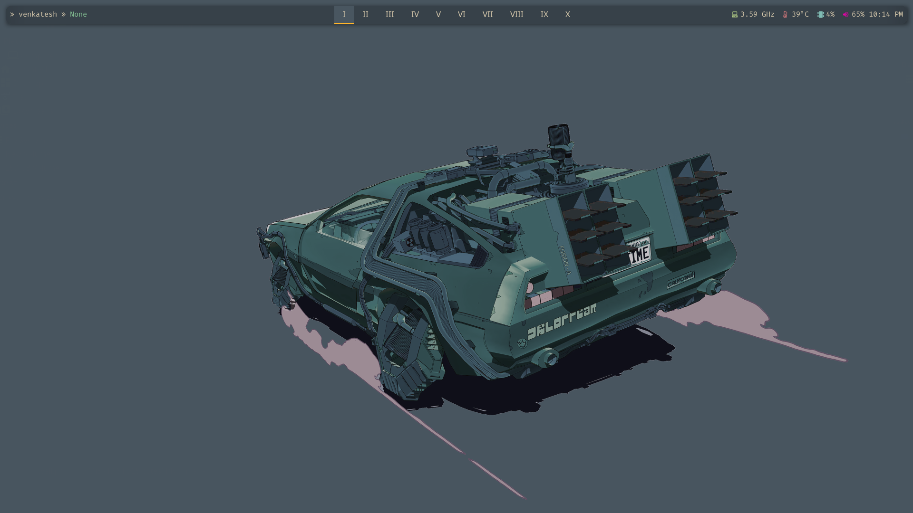
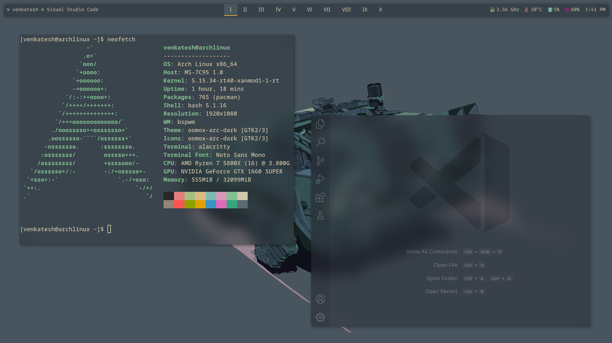
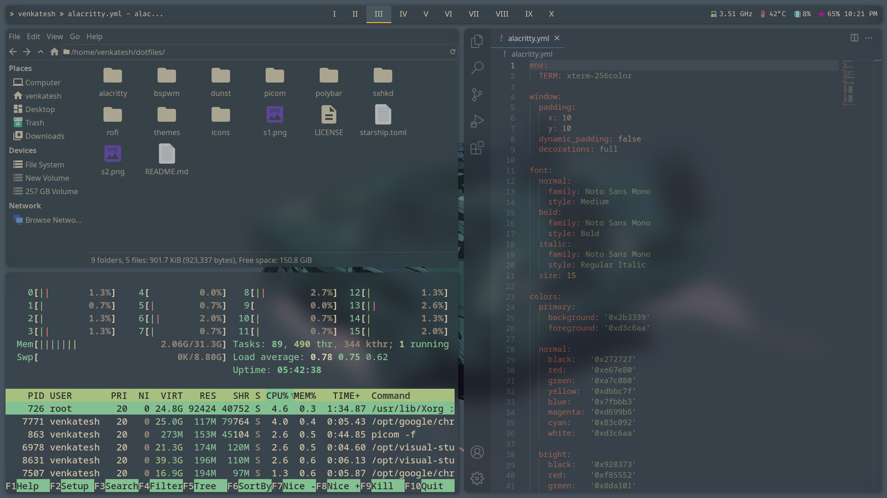

# Modern Everforest vibes

## Used software

Here is a list of the used software for these dotfiles

- **Window manager**: [`BSPWM`](https://github.com/baskerville/bspwm)
- **Compositor**: [`picom(ibhagwan fork)`](https://github.com/ibhagwan/picom) Because rounded corners >
- **Terminal**: [`alacritty`](https://github.com/alacritty/alacritty) Noice Terminal
- **Bar**: [`polybar`](https://github.com/polybar/polybar) Need to change it to `tint2` though
- **Launcher**: [`rofi`](https://github.com/davatorium/rofi) With some scripts I found
- **Notifications**: [`dunst`](https://github.com/dunst-project/dunst)
- **Editor**: [`vscode`](https://github.com/microsoft/vscode) with a lot of extensions ( specially the glassit-vsc extension )

## Installation

**Arch:**

```
// install all the required stuff
pacman -S bspwm alacritty rofi dunst 

// Install stuff from AUR
yay -S picom-ibhagwan-git sxhkd polybar oft-nerd-fonts-fira-code nerd-fonts-fira-code ttf-font-awesome visual-studio-code-bin
```

Basically you just copy paste all configs whereever you need them. In `rofi` you need to copy the `rofi-power-menu` to `/usr/bin/`

## Screenshots



