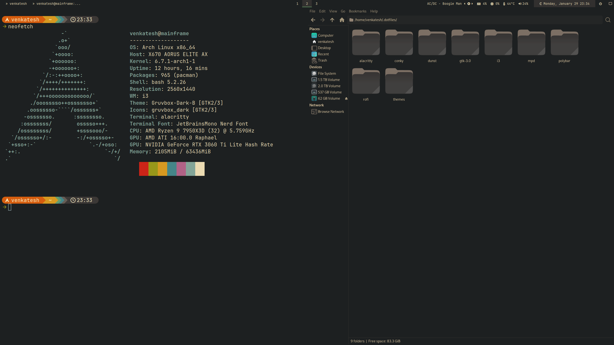

# Dotfiles

This repository contains my personal dotfiles, which are the configuration files for various operating systems and tools. I manage these dotfiles using the [Dotter](https://github.com/SuperCuber/dotter), a dotfile manager and templater written in Rust.




## Introduction

Dotfiles are configuration files that customize the behavior and appearance of software applications and operating systems. This repository serves as a centralized location for storing and version-controlling my dotfiles, making it easy to synchronize them across different machines.

## List of programs

- Window manager: [i3](https://github.com/i3/i3)
- Terminal: [alacritty](https://github.com/alacritty/alacritty)
- Bar: [polybar](https://github.com/polybar/polybar)
- Launcher: [rofi](https://github.com/davatorium/rofi)
- Notifications: [dunst](https://github.com/dunst-project/dunst)
- Editor: [neovim](https://github.com/neovim/neovim) with [nvchad](https://github.com/NvChad/NvChad)

## Usage

To use these dotfiles, follow these steps:

1. Clone this repository to your local machine:

     ```bash
     git clone --recursive https://git.tablaster.dev/blaster4385/dotfiles.git
     ```
1. Change to the dotfiles directory:

     ```bash
     cd dotfiles
     ```
1. Install Dotter if you haven't already. You can find the installation instructions in the [Dotter repository](https://github.com/SuperCuber/dotter).

1. Deploy the configs using dotter:
     ```bash
     ./dotter deploy
     ```

     This command will deploy the dotfiles to their respective target locations, based on the configurations defined in the `.dotter` directory.

1. Customize the dotfiles according to your preferences. Feel free to modify or add any configuration files to suit your needs.

## Credits
- Gruvbox GTK theme by [Fausto-Korpsvart](https://github.com/Fausto-Korpsvart/Gruvbox-GTK-Theme).

## Contributing

If you find any issues with these dotfiles or have suggestions for improvements, please feel free to open an issue or submit a pull request. Contributions are welcome!

## License

This repository is licensed under the GNU GPLv3. See the [LICENSE](LICENSE) file for more information.
